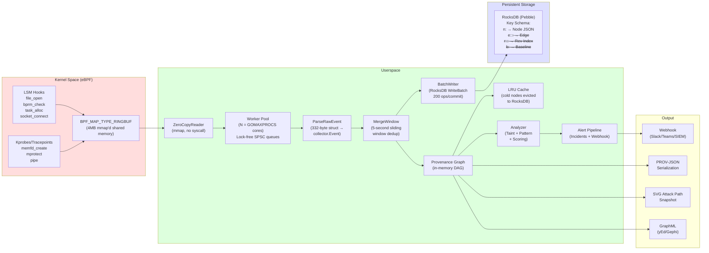
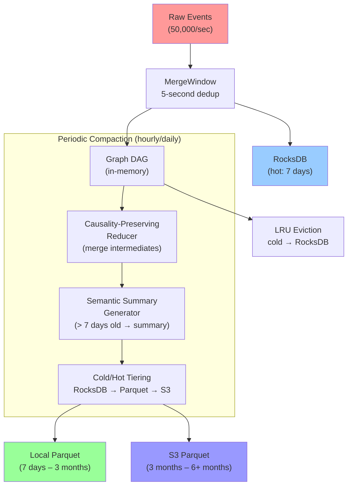

# ProvidAPT Technical Architecture

**Version 1.0** | System Design and Data Flow

---

## Table of Contents

- [1. System Overview](#1-system-overview)
- [2. Data Flow Architecture](#2-data-flow-architecture)
- [3. eBPF ↔ Userspace Ring Buffer Protocol](#3-ebpf--userspace-ring-buffer-protocol)
- [4. RocksDB Storage Schema](#4-rocksdb-storage-schema)
- [5. Graph Construction and Data Reduction](#5-graph-construction-and-data-reduction)
- [6. Module Reference](#6-module-reference)

---

## 1. System Overview

ProvidAPT is a Linux system provenance monitor that uses eBPF (extended Berkeley Packet Filter) to capture kernel-level events and reconstructs them into a W3C PROV-compliant directed acyclic graph (DAG) in userspace. The system is designed for APT attack detection and forensic analysis.

### 1.1 Architecture Layers

```
┌─────────────────────────────────────────────────────────────┐
│                     User Interface Layer                     │
│  ┌──────────┐  ┌──────────┐  ┌──────────┐  ┌────────────┐  │
│  │providaptd│  │providapt │  │providapt │  │  HTTP API   │  │
│  │ (daemon) │  │-ctl      │  │-verify   │  │ (Gin REST) │  │
│  └────┬─────┘  └──────────┘  └──────────┘  └──────┬─────┘  │
├───────┼────────────────────────────────────────────┼────────┤
│       │            Analysis Layer                   │        │
│  ┌────▼─────────────────────────────────────────────▼────┐  │
│  │                   Pipeline Engine                      │  │
│  │  ┌────────┐  ┌────────┐  ┌────────┐  ┌────────────┐  │  │
│  │  │ZeroCopy│─▶│Worker  │─▶│Merge   │─▶│Batch Writer│  │  │
│  │  │Reader  │  │Pool    │  │Window  │  │(RocksDB)   │  │  │
│  │  └────────┘  └────────┘  └────────┘  └────────────┘  │  │
│  └────────────────────────────────────────────────────────┘  │
│                           │                                   │
│  ┌────────────────────────▼────────────────────────────────┐  │
│  │  Provenance Graph (DAG)                                 │  │
│  │  ┌────────┐  ┌────────┐  ┌────────┐  ┌──────────────┐  │  │
│  │  │ Nodes  │  │ Edges  │  │Version │  │ CredTracker  │  │  │
│  │  │ (map)  │  │ (map)  │  │Tracker │  │ (state mach) │  │  │
│  │  └────────┘  └────────┘  └────────┘  └──────────────┘  │  │
│  └────────────────────────────────────────────────────────┘  │
│                           │                                   │
│  ┌────────────────────────▼────────────────────────────────┐  │
│  │  Analysis Engine                                        │  │
│  │  ┌────────┐  ┌────────┐  ┌────────┐  ┌──────────────┐  │  │
│  │  │Taint   │  │Pattern │  │Scoring │  │ AI           │  │  │
│  │  │Tracker │  │Matcher │  │Engine  │  │ Interpreter  │  │  │
│  │  └────────┘  └────────┘  └────────┘  └──────────────┘  │  │
│  └────────────────────────────────────────────────────────┘  │
├──────────────────────────────────────────────────────────────┤
│                     Storage Layer                             │
│  ┌────────────────────────────────────────────────────────┐  │
│  │  RocksDB (Pebble)                                       │  │
│  │  ┌──────────┐  ┌──────────┐  ┌──────────┐  ┌────────┐ │  │
│  │  │Hot Nodes │  │Edges    │  │Baseline │  │Anchors │ │  │
│  │  │(n:*)    │  │(e:* r:*)│  │(b:*)    │  │(anchor)│ │  │
│  │  └──────────┘  └──────────┘  └──────────┘  └────────┘ │  │
│  └────────────────────────────────────────────────────────┘  │
│  ┌────────────────────────────────────────────────────────┐  │
│  │  LRU Cache (hot nodes in memory)                       │  │
│  └────────────────────────────────────────────────────────┘  │
├──────────────────────────────────────────────────────────────┤
│                   Kernel Layer (eBPF)                         │
│  ┌──────────┐  ┌──────────┐  ┌──────────┐  ┌────────────┐  │
│  │ LSM Hooks│  │Kprobes   │  │Tracepoints│  │ Uprobes    │  │
│  │(file_open│  │(do_unlink│  │(memfd    │  │(SSL_read,  │  │
│  │ task_alloc│  │ )        │  │ _create) │  │ nginx_req) │  │
│  └──────────┘  └──────────┘  └──────────┘  └────────────┘  │
│         │            │            │              │           │
│         └────────────┴────────────┴──────────────┘           │
│                          │                                   │
│                    ┌─────▼─────┐                             │
│                    │ BPF Ring  │                             │
│                    │ Buffer    │                             │
│                    │ (mmap'd)  │                             │
│                    └───────────┘                             │
└──────────────────────────────────────────────────────────────┘
```

---

## 2. Data Flow Architecture

### 2.1 End-to-End Data Flow



### 2.2 Event Processing Timeline

```
T(+0)  eBPF hook fires → copies data to ring buffer
T(+1)  ZeroCopyReader reads mmap'd buffer (zero-system-call)
T(+2)  Dispatcher round-robins raw bytes to Worker N
T(+3)  Worker parses 332-byte struct → collector.Event
T(+4)  MergeWindow checks: same (source, target, relation) in 5s?
         ├── Yes → increment count, skip write
         └── No  → write to WriteBatch, flush at 200 ops
T(+5)  Graph.AddEvent() → update DAG
T(+6)  LRU cache touch (evict cold nodes to RocksDB if full)
T(+7)  Analyzer.OnEvent() → taint propagation → pattern matching
T(+8)  Alert triggered → webhook sent
```

---

## 3. eBPF ↔ Userspace Ring Buffer Protocol

### 3.1 Shared Memory Architecture

ProvidAPT uses `BPF_MAP_TYPE_RINGBUF` for kernel-to-userspace data transfer. The ring buffer is:

- **Size**: 4 MB (configurable, defined as `RINGBUF_SIZE` in `providapt.h`)
- **Mechanism**: mmap-based shared memory
- **Producer**: Multiple eBPF programs (LSM hooks, tracepoints, kprobes)
- **Consumer**: Single userspace goroutine (ZeroCopyReader)
- **Synchronization**: Lock-free (BPF ring buffer uses memory barriers)

```
Kernel (producer)                    Userspace (consumer)
┌─────────────┐                     ┌──────────────┐
│ eBPF Prog 1 │  reserve()          │  ringbuf.    │
│ eBPF Prog 2 │──submit()──▶┌──────┐│  Reader      │
│ eBPF Prog 3 │             │mmap'd││  .Read()     │
│ ...         │             │ Ring ││──▶ raw bytes │
└─────────────┘             │ Buf  ││              │
                            └──────┘└──────────────┘
```

### 3.2 Event Structure (wire format, 332 bytes)

Every event in the ring buffer is a fixed-size `struct event` (332 bytes), defined in `cmd/bpf/headers/providapt.h`:

```
Offset  │ Size │ Field         │ Type      │ Description
────────┼──────┼───────────────┼───────────┼────────────────
      0 │    4 │ type          │ u32       │ Event type enum
      4 │    4 │ flags         │ u32       │ Event flags
      8 │    8 │ timestamp_ns  │ u64       │ Monotonic clock
     16 │    4 │ pid           │ u32       │ Process ID
     20 │    4 │ tid           │ u32       │ Thread ID
     24 │    4 │ ppid          │ u32       │ Parent PID
     28 │    4 │ uid           │ u32       │ User ID
     32 │    4 │ gid           │ u32       │ Group ID
     36 │   24 │ payload       │ union     │ Event-specific data
        │      │  ├─ inode     │ u64       │  (file events)
        │      │  ├─ dev_major │ u32       │
        │      │  ├─ dev_minor │ u32       │
        │      │  ├─ mode      │ u32       │
        │      │  ├─ f_flags   │ u32       │
        │      │  ├─ child_pid │ u32       │  (fork events)
        │      │  └─ pad      │ [20]byte  │
     60 │   16 │ comm          │ char[16]  │ Process name
     76 │  256 │ pathname      │ char[256] │ File path / memfd name
     ────┴──────┴───────────────┴───────────┴────────────────
     332 total bytes (__attribute__((packed)))
```

### 3.3 Event Types

```c
#define EV_PROCESS_FORK      1   // task_alloc LSM hook
#define EV_PROCESS_EXEC      2   // bprm_check_security LSM hook
#define EV_PROCESS_EXIT      3   // task_free LSM hook
#define EV_FILE_OPEN        10   // file_open LSM hook
#define EV_FILE_CREATE      11   // file_open + O_CREAT flag
#define EV_FILE_MODIFY      12   // file_open + O_WRONLY/O_RDWR
#define EV_FILE_DELETE      13   // do_unlinkat kprobe
#define EV_FILE_RENAME      14   // rename tracepoint
#define EV_NET_CONNECT      20   // socket_connect LSM hook
#define EV_NET_ACCEPT       21   // socket_accept LSM hook
#define EV_NET_SEND         22   // (placeholder)
#define EV_NET_RECV         23   // (placeholder)
#define EV_CRED_SETUID      40   // bprm_check + setuid flag
#define EV_CRED_CAPABLE     41   // security_capable kprobe
#define EV_MEMFD_CREATE     50   // sys_enter_memfd_create
#define EV_MPROTECT_RX      51   // mprotect RW→RX detection
#define EV_PIPE_WRITE       52   // pipe write tracking
#define EV_PIPE_READ        53   // pipe read tracking
#define EV_SAMPLE          100   // adaptive sampling aggregate
#define EV_AGENT_KILLED    200   // defense: agent death event
#define EV_FILE_DENIED     201   // defense: unauthorised write
#define EV_HONEY_TRIGGER   210   // honeypot: honey path access
```

### 3.4 Payload Union Layout

```
File events (type 10-14):
  offset 36: inode      (u64) — file inode number
  offset 44: dev_major  (u32) — major device number
  offset 48: dev_minor  (u32) — minor device number
  offset 52: mode       (u32) — file mode (S_IFMT + permissions)
  offset 56: f_flags    (u32) — open flags (O_RDONLY/O_WRONLY/O_CREAT)

Fork events (type 1):
  offset 36: child_pid  (u32) — PID of the child process
  offset 40: pad        ([20]byte)

Network events (type 20-23):
  offset 36: saddr      (u32) — source IPv4
  offset 40: daddr      (u32) — destination IPv4
  offset 44: sport      (u16) — source port
  offset 48: dport      (u16) — destination port
  offset 52: protocol   (u8)  — IP protocol (6=TCP, 17=UDP)
```

### 3.5 CO-RE Relocation

All kernel struct accesses use `BPF_CORE_READ()` macros, which generate BTF relocation records. The same `.bpf.o` bytecode can load on any kernel ≥5.11 without recompilation.

```c
// Example: reading file inode with CO-RE
struct inode *inode = BPF_CORE_READ(file, f_inode);
u64 ino = BPF_CORE_READ(inode, i_ino);

// At load time, libbpf adjusts field offsets based on BTF info
// from /sys/kernel/btf/vmlinux
```

---

## 4. RocksDB Storage Schema

### 4.1 Key Space Design

ProvidAPT uses CockroachDB Pebble (a pure-Go RocksDB-compatible engine) with lexicographically sortable string keys.

```
Key Prefix │ Schema                           │ Content
───────────┼──────────────────────────────────┼───────────────────────
n:         │ n:<node_id>                      │ Node JSON
e:         │ e:<ts_hex>:<source>:<target>    │ Edge JSON
r:         │ r:<target>:<ts_hex>:<source>    │ Edge JSON (reverse index)
b:         │ b:<hash>                         │ Baseline entry marker
anchor:    │ anchor:<timestamp>               │ Merkle root anchor
evidence:  │ evidence:<case_id>               │ Forensic evidence record
filter:    │ filter:baseline                  │ Baseline hash set (JSON)
           │ filter:lowlevel:<hash>           │ Low-level event summary
```

### 4.2 Node Storage

```
Key:   n:p:1234
Value: {"id":"p:1234","prov_type":"prov:Activity","subtype":"process",
        "label":"bash","first_seen":"...","last_seen":"...",
        "attributes":{"pid":1234,"uid":1000,"comm":"bash"}}
```

Node ID format:

| Prefix | Format | Example |
|--------|--------|---------|
| Process | `p:<pid>` | `p:1234` |
| File (inode) | `f:<inode>:<major>:<minor>` | `f:5000:8:3` |
| File (path hash) | `f:path:<hash>` | `f:path:a3f8b2c1e4d5` |
| Versioned file | `f:<inode>:<m>:<mn>#v<ver>` | `f:5000:8:3#v2` |
| Network | `n:<addr>:<port>` | `n:5.6.7.8:443` |
| Transaction | `txn:<seq>` | `txn:42` |
| Credential | `c:<pid>:<timestamp>` | `c:1234:1000` |
| Memory region | `rx:<addr>:<pid>` | `rx:7f1234560000:100` |
| Pipe | `pipe:<pid>:<ts>` | `pipe:300:1000` |
| memfd | `memfd:<pid>:<ts>` | `memfd:400:1` |

### 4.3 Edge Storage

Primary index (time-range ordered):

```
Key:   e:0000001743123456:p:100:f:5000:8:3
Value: {"source":"p:100","target":"f:5000:8:3",
        "relation":"prov:used","count":42,
        "timestamp":"2026-05-28T12:00:00Z"}
```

Key structure:

```
e:<20-digit hex timestamp>:<source_id>:<target_id>
```

The 20-digit hex timestamp enables lexicographic time-range scans. For example, to query events between T1 and T2:

```go
startKey = fmt.Sprintf("e:%020x", T1.UnixNano())
endKey   = fmt.Sprintf("e:%020x", T2.UnixNano())
// Pebble prefix scan on [startKey, endKey)
```

### 4.4 Reverse Index

The reverse index enables O(log n) backward graph traversal for impact assessment:

```
Key:   r:f:5000:8:3:0000001743123456:p:100
Value: (same Edge JSON as primary)
```

Find all edges pointing to a node:

```go
// Prefix scan: r:f:5000:8:3:
// Returns all edges where Target == "f:5000:8:3"
```

### 4.5 Baseline Storage

```
Key:   filter:baseline
Value: {"hash1":42,"hash2":15,...}  (JSON map of behavioural hashes)
```

### 4.6 Cold Data Index

When data is archived to Parquet/S3, an index entry is kept locally:

```
Key:   cold:<entity_id>
Value: {"bucket":"providapt-archive","key":"provenance/2025/01/01/..."}
```

### 4.7 Merkle Anchor Storage

```
Key:   anchor:1743123456000000000
Value: {"timestamp":"...","leaf_count":1500000,
        "root_hash":"a3f8b2c1...","signature":"..."}
```

### 4.8 Write Path Optimizations

All writes go through an internal WriteBatch (200 ops per commit):

```
eBPF Ring Buffer → Parse → MergeWindow → PutEdge() → WriteBatch → Pebble
                                   │                       │
                             5-second dedup          200 ops or 2s
                                                      auto-flush
```

Batch commit uses `pebble.WriteOptions{Sync: false}` for throughput, with periodic `Flush()` for durability.

---

## 5. Graph Construction and Data Reduction

### 5.1 Provenance Graph DAG

The provenance graph is a directed acyclic graph (DAG) following W3C PROV-DM:

```
Three node types:
  prov:Activity   — Processes (actors)
  prov:Entity     — Files, network endpoints, memory regions, pipes
  prov:Agent      — Users (via PAM identity tracking)

Five edge relations:
  prov:used(e,a)               — Activity a used Entity e  (read/connect)
  prov:wasGeneratedBy(e,a)     — Entity e created by a      (write/create)
  prov:wasInformedBy(a2,a1)    — Activity a2 informed by a1 (fork)
  prov:wasDerivedFrom(e2,e1)   — Entity e2 derived from e1  (versioning)
  prov:hadSecurityContext(a,c) — Activity a had credential c (setuid)
```

### 5.2 Event-to-Graph Mapping

Each kernel event is mapped to PROV relations:

| Event | PROV Pattern | Graph Impact |
|-------|-------------|-------------|
| `process_fork` | `wasInformedBy(child, parent)` | New process node + edge |
| `process_exec` | `used(process, binary_file)` | Edge to file node |
| `file_open` (read) | `used(process, file)` | Edge to file node |
| `file_create` (write) | `wasGeneratedBy(file, process)` | New file version + edge |
| `file_modify` (write) | `wasGeneratedBy(file, process)` | New file version + edge |
| `net_connect` | `used(process, network_ep)` | Edge to network node |
| `memfd_create` | `used(process, memory_file)` | Anonymous file node |
| `mprotect_rx` | `used(process, memory_region)` | Memory region node |
| `pipe_write/read` | `used(process, pipe)` | Pipe node |
| `setuid` | `hadSecurityContext(process, cred)` | Credential node + state change |

### 5.3 Data Reduction Algorithms

#### 5.3.1 Sliding-Window Edge Merge

**Purpose**: Reduce repeated edges from the same (source, target, relation).

**Algorithm**:

```
For each new edge E(source, target, relation):
    key = source + "|" + target + "|" + relation
    
    Lookup key in MergeWindow (5-second hash map):
    
    if found:
        // Within same window — merge
        existing.count += E.count
        existing.last_seen = E.timestamp
        // NO WRITE TO ROCKSDB
    else:
        // New edge — track in window
        window[key] = {source, target, relation,
                       count: 1, first_seen: now}
        // WRITE TO ROCKSDB (first occurrence)
    
    Every 5 seconds (Flush):
        for each entry in window:
            Write entry to RocksDB (with accumulated count)
        Clear window
```

**Effect**: 500 identical file-read events → 1 RocksDB write with count=500.

**Reduction ratio**: ~40-99% depending on event repetition.

#### 5.3.2 Entity Versioning

**Purpose**: Preserve causality across write operations without duplication.

**Algorithm**:

```
For each file write event E:
    base_id = "f:<inode>:<dev_major>:<dev_minor>"
    version = version_tracker.get_next(base_id)
    new_id = base_id + "#v" + version
    
    Create node: new_id (copy attributes from previous version)
    Create edge: wasDerivedFrom(new_id, previous_version_id)
    Create edge: wasGeneratedBy(new_id, process)
    
    Read operations always target the LATEST version:
    read_target = base_id + "#v" + version_tracker.latest(base_id)
```

**Effect**: N write operations produce N versioned nodes with `wasDerivedFrom` chain, preserving full edit history.

#### 5.3.3 Causality-Preserving Node Merging

**Purpose**: Merge intermediate short-lived nodes that have no external IO.

**Algorithm** (in `internal/engine/compact/reducer.go`):

```
For each node N in graph:
    if N.isIntermediate():
        // Criteria:
        //   1. Lifespan < 5 minutes
        //   2. Node degree ≤ 2
        //   3. No external IO (file/network interactions)
        //   4. Not a sensitive node (shadow, ssh, etc.)
        
        Find all edges A→N and N→B
        Replace each pair A→N→B with a single edge A→B
        
        // Aggregated edge preserves causality:
        new_edge.count = edge_A_N.count + edge_N_B.count
        new_edge.timestamp = edge_N_B.timestamp (last event)
        
        Delete node N and edges A→N, N→B
```

**Example transformation**:

```
BEFORE:
  sshd ──fork──▶ bash (temp) ──write──▶ /tmp/out
                    │
                    ├ lifespan: 3 seconds
                    ├ degree: 2
                    └ no external IO

AFTER:
  sshd ────────────────────write──▶ /tmp/out
  (edge count: 15, time range preserved)
```

**Reduction ratio**: ~30-60% of short-lived process nodes removed.

#### 5.3.4 Semantic Summary Generation

**Purpose**: Abstract fine-grained I/O into behaviour summaries for data > 7 days.

**Algorithm** (in `internal/engine/compact/summary.go`):

```
For edges older than SummaryAge (7 days):
    group edges by (source, target, relation)
    
    if group.size >= MinEventsForSummary (default 1000):
        create BehaviourSummary:
            process_id = group[0].source
            target = group[0].target
            operation = group[0].relation
            total_calls = len(group)
            total_bytes = len(group) * 332 (estimated)
            time_start = group[0].timestamp
            time_end = group[-1].timestamp
        
        DELETE all original edges
        INSERT BehaviourSummary (compact representation)
```

**Transformation**:

```
100,000 RAW EDGES:
  nginx → access.log [READ] × 50000
  nginx → access.log [WRITE] × 50000

→ 1 BEHAVIOUR SUMMARY:
  [process: nginx] [target: access.log] [R+W 100,000 calls] [~33 MB]
  [time: 2025-01-01T00:00 ~ 2025-01-01T23:59]

Storage saved: ~99,999 edges (99.999%)
```

#### 5.3.5 LRU Cache Eviction

**Purpose**: Keep hot nodes in memory, evict cold nodes to RocksDB.

**Algorithm** (in `internal/storage/cache/lru.go`):

```
Cache capacity: 8,192 nodes (configurable)

On cache.Add(node_id):
    if node_id already in cache:
        move to front (MRU position)
    else:
        if cache is full:
            // Evict LRU node (tail of linked list)
            lru_node = order.back()
            persist_to_rocksdb(lru_node)
            remove lru_node from cache
        
        insert node_id at front
```

**Memory impact**: ~200 MB for 8,192 nodes. Scales linearly.

#### 5.3.6 Combined Reduction Pipeline

The full compaction pipeline combines all reduction techniques:



### 5.4 Thread Safety Model

The graph uses `sync.RWMutex` for concurrent access:

```
Readers (multiple, parallel):
  - Graph.Nodes()       — snapshot
  - Graph.Edges()       — snapshot
  - Graph.LookupNode()  — single node
  - Graph.Stats()        — counts
  - SerializeJSON()      — export
  - SerializeGraphML()   — export
  - ProvQL queries      — read-only execution

Writer (single):
  - Graph.AddEvent()     — only caller that mutates the graph
  
Lock strategy:
  - Writers hold Write lock (exclusive)
  - Readers hold Read lock (shared, parallel)
  - No deadlock: all locks are non-recursive
```

---

## 6. Module Reference

### 6.1 Package Dependency Graph

```
cmd/providaptd
    ├── pkg/loader      (eBPF program loading)
    ├── pkg/pipeline    (event ingestion pipeline)
    │   ├── pkg/collector  (ring buffer parsing)
    │   └── pkg/store      (RocksDB storage)
    ├── pkg/provenance  (graph DAG)
    ├── pkg/analyzer    (APT detection)
    ├── pkg/api         (HTTP API)
    └── pkg/defense     (self-defence)

cmd/providapt-verify
    └── pkg/secure      (Merkle tree, SST signing)

cmd/providapt-heal
    └── pkg/heal        (impact assessment, rollback, firewall)

cmd/providapt-deanon
    └── pkg/anonymize   (de-anonymization)
```

### 6.2 Key Metrics

| Component | Metric | Typical Value |
|-----------|--------|---------------|
| Ring buffer throughput | Events/sec | 50,000 |
| Event size | Bytes | 332 |
| eBPF hook latency | Microseconds | <1 |
| Parse latency | Nanoseconds | ~200 |
| RocksDB write latency | Microseconds | ~400 per batch |
| LRU cache hit rate | Ratio | ~85% |
| Merge window reduction | Ratio | ~40% |
| Graph node memory | Bytes/node | ~512 |
| Graph edge memory | Bytes/edge | ~256 |

### 6.3 Data Flow Diagram

```mermaid
flowchart TD
    subgraph "Kernel Space"
        LSM1["LSM: file_open"] --> RB1["Ring Buffer A"]
        LSM2["LSM: bprm_check"] --> RB1
        LSM3["LSM: task_alloc"] --> RB1
        LSM4["LSM: socket_connect"] --> RB2["Ring Buffer B\n(network)"]
        TP1["TP: memfd_create"] --> RB3["Ring Buffer C\n(memory)"]
    end

    subgraph "Userspace Pipeline"
        RB1 --> ZC1["ZeroCopyReader"]
        RB2 --> ZC2["ZeroCopyReader"]
        RB3 --> ZC3["ZeroCopyReader"]
        
        ZC1 --> DISP["Dispatcher\n(Round-Robin)"]
        ZC2 --> DISP
        ZC3 --> DISP
        
        DISP --> W1["Worker 1\n(Parse 332B → Event)"]
        DISP --> W2["Worker 2\n(Parse)"]
        DISP --> WN["Worker N\n(Parse)"]
        
        W1 --> MW["MergeWindow\n(5s dedup)"]
        W2 --> MW
        WN --> MW
        
        MW --> GRAPH["Provenance Graph\n(DAG)"]
        MW --> CACHE["LRU Cache\n(8K hot nodes)"]
        MW --> BATCH["BatchWriter\n(RocksDB)"]
        
        GRAPH --> ANALYZER["Analyzer Engine"]
        ANALYZER --> ALERT["Alert Pipeline"]
    end

    subgraph "Storage"
        BATCH --> ROCKS["Pebble/RocksDB"]
        CACHE -- "eviction" --> ROCKS
        ROCKS --> ARCHIVE["Cold Tier\n(Parquet/S3)"]
    end

    subgraph "APIs & Output"
        GRAPH --> REST["REST API\n(Cytoscape JSON)"]
        GRAPH --> GRAPHML["GraphML\n(yEd/Gephi)"]
        GRAPH --> SVG["SVG Snapshots"]
        GRAPH --> PROVQL["ProvQL\n(Graph Query)"]
        ALERT --> WEBHOOK["Webhook\n(Slack/SIEM)"]
        ANALYZER --> AI["AI Report\n(LLM)"]
    end

    style "Kernel Space" fill:#ffcccc
    style "Userspace Pipeline" fill:#ccffcc
    style "Storage" fill:#ccccff
    style "APIs & Output" fill:#ffffcc
```
